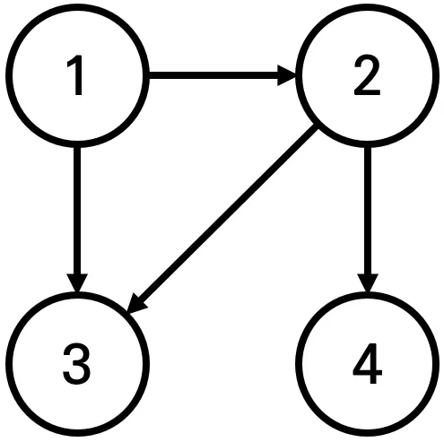

# [백준 18352번] 특정 거리의 도시 찾기

- **문제 링크** : [특정 거리의 도시 찾기](https://boj.kr/18352)
- **난이도** : 실버 2
- **풀이 날짜** : 2025-02-24
---

## 📖 문제 설명

> 어떤 나라에는 1번부터 N번까지의 도시와 M개의 단방향 도로가 존재한다. 모든 도로의 거리는 1이다.
>
>이 때 특정한 도시 X로부터 출발하여 도달할 수 있는 모든 도시 중에서, 최단 거리가 정확히 K인 모든 도시들의 번호를 출력하는 프로그램을 작성하시오. 또한 출발 도시 X에서 출발 도시 X로 가는 최단 거리는 항상 0이라고 가정한다.
>
>예를 들어 N=4, K=2, X=1일 때 다음과 같이 그래프가 구성되어 있다고 가정하자.
>
> 
>이 때 1번 도시에서 출발하여 도달할 수 있는 도시 중에서, 최단 거리가 2인 도시는 4번 도시 뿐이다.  2번과 3번 도시의 경우, 최단 거리가 1이기 때문에 출력하지 않는다.
## 📌 입력

> 첫째 줄에 도시의 개수 N, 도로의 개수 M, 거리 정보 K, 출발 도시의 번호 X가 주어진다. (2 ≤ N ≤ 300,000, 1 ≤ M ≤ 1,000,000, 1 ≤ K ≤ 300,000, 1 ≤ X ≤ N) 둘째 줄부터 M개의 줄에 걸쳐서 두 개의 자연수 A, B가 공백을 기준으로 구분되어 주어진다. 이는 A번 도시에서 B번 도시로 이동하는 단방향 도로가 존재한다는 의미다. (1 ≤ A, B ≤ N) 단, A와 B는 서로 다른 자연수이다.

## 📌 출력

> X로부터 출발하여 도달할 수 있는 도시 중에서, 최단 거리가 K인 모든 도시의 번호를 한 줄에 하나씩 오름차순으로 출력한다.

이 때 도달할 수 있는 도시 중에서, 최단 거리가 K인 도시가 하나도 존재하지 않으면 -1을 출력한다.

## ⌨️ 예제 입출력
### 입력

```python
4 4 2 1
1 2
1 3
2 3
2 4
```
### 출력

```python
4
```

---

## 📝 풀이 코드

```python
import sys                           # sys 모듈: 시스템 관련 기능을 사용하기 위해 불러옴 (예: 빠른 입력 처리)
from collections import deque

input = sys.stdin.readline

N, M, K, X = map(int, input().split()) # 도시 개수, 도로 개수, 거리 정보, 출발 도시

A = [[] for _ in range(N+1)] # 인접 리스트

visited = [-1] * (N+1) # 도착 정보(방문 거리)

answer = [] # 정답 리스트


def bfs(v): # bfs
    queue = deque()
    queue.append(v)
    visited[v] += 1
    while  queue:
        now = queue.popleft()
        for i in A[now]:
            if visited[i] == -1:
                visited[i] = visited[now] + 1
                queue.append(i)


for _ in range(M): # 인접리스트
    s, e = map(int, input().split())
    A[s].append(e)


bfs(X)


for i in range(N+1): # 거리 정보와 일치하는 것이 있으면 추가
    if visited[i] == K:
        answer.append(i)

if not answer:
    print(-1)
else:
    answer.sort()
    for i in answer:
        print(i)
```

---
 
### 🔍 코드 설명
- bfs를 이용해 각 도시로 가는 최단거리를 구한다.    
